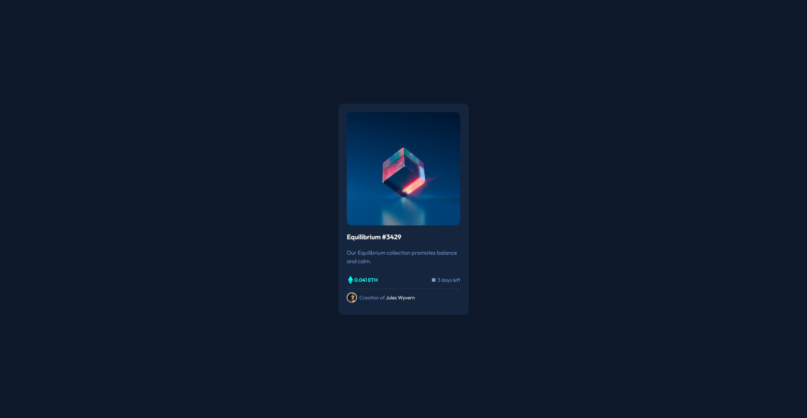

# Frontend Mentor - NFT preview card component solution

This is a solution to the [NFT preview card component challenge on Frontend Mentor](https://www.frontendmentor.io/challenges/nft-preview-card-component-SbdUL_w0U). Frontend Mentor challenges help you improve your coding skills by building realistic projects. 

## Table of contents

- [Overview](#overview)
  - [The challenge](#the-challenge)
  - [Screenshot](#screenshot)
  - [Links](#links)
- [My process](#my-process)
  - [Built with](#built-with)
  - [What I learned](#what-i-learned)
  - [Continued development](#continued-development)
  - [Useful resources](#useful-resources)
- [Author](#author)

## Overview

### The challenge

Users should be able to:

- View the optimal layout depending on their device's screen size
- See hover states for interactive elements

### Screenshot

### Links

## My process

I started by reviewing the design then looking at the card with a mobile view first. I created a rough mark up of all the major elements necessary in the card itself.

I went through the CSS created the general global styles and then created custom variables for the colors located in the style-guide.md. 

From there it was a focus on the order of the css breakdown, global, typography, layout. The layout had me go back to the html markup and add in extra div block level elements to contain sections of the page for an easier time with CSS manipulation.

Then the ::after psuedoelements were created and tweaked. Lastly, the hover states were implemented along with icons

### Built with

- Semantic HTML5 markup
- CSS custom properties
- Flexbox
- CSS Grid
- Mobile-first workflow

### What I learned

Using the rem, em, and ch units are still a new thing for me but I'm looking forward to utilizing them more since they are powerful units for responsive design, however I'm definitely still not too comfortable in their usage.

Grid and Flexbox are amazing layout organizational tools that I need to understand in further depth when I go beyond just simple card component creation tools

Organizing the CSS and grouping the stylesheet into major sections (Global, Typography, Layout) I felt made it more readable and for now I feel like to be more mindful about what I'm working on the comments are still necessary for me to understand what each line of CSS is contributing.

I am starting to think about DRY code, however it's still not at the forefront of my learning process since I'm trying to just get the CSS to work and look the way I want for now.

### Continued development

Use this section to outline areas that you want to continue focusing on in future projects. These could be concepts you're still not completely comfortable with or techniques you found useful that you want to refine and perfect.

I'm still unsure on how exactly does the positioning work for the cover-image as I set it to relative but yet the .card-image:hover::after is positioned absolute inside that container. I just saw that it worked and left it alone. So more personal reading is required there.

I'd also love to include some transitions to make the hover effects more pleasing to the eye.

### Useful resources
- [Kevin Powell CSS card with hover animation](https://youtu.be/5DEq5cWNYt8) - I didn't use any of the animation elements, but this helped with me creating the after psuedoelement for the line to separate the card info and the attribution as well as figuring out how to place the whole card centered with a grid by setting a min view height, the default margin padding to 0, and the box-sizing to border-box.
- [stack overflow answer on overlay on image hover with css](https://stackoverflow.com/questions/18322548/black-transparent-overlay-on-image-hover-with-only-css) - This helped me since I couldn't figure out how to display the icon-view.svg file on hover. I really liked this pattern since the usage of the after psuedoelement allowed me to fully control the transparent background separately from the before psuedoelement where I had the svg positioned.
- [stack overflow answer on centering absolutely positioned elements](https://stackoverflow.com/questions/1776915/how-can-i-center-an-absolutely-positioned-element-in-a-div) - Being new and intimidated by using absolute positioning, this was super helpful in keeping my responsive as I was really trying to not use px measurements.

## Author

- Website - [Add your name here](https://www.your-site.com)
- Frontend Mentor - [@yourusername](https://www.frontendmentor.io/profile/yourusername)
- Twitter - [@yourusername](https://www.twitter.com/yourusername)
